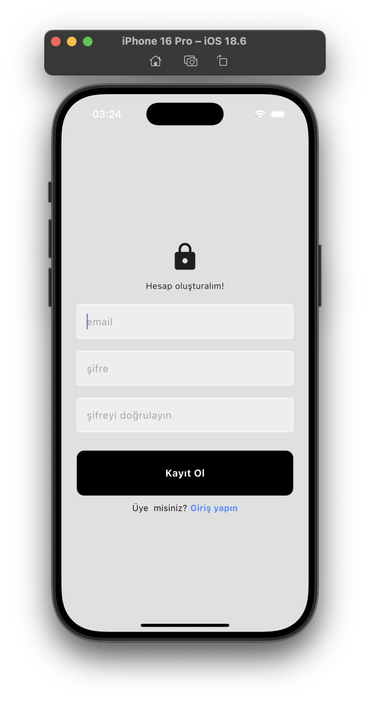

# The Wall App

Bu proje, Flutter kullanılarak geliştirilmiş bir sosyal medya uygulamasının başlangıç versiyonudur. Kullanıcılar kendi duvarlarına yazı yazabilir, profillerinde görebilir, diğer kullanıcıların paylaşımlarını görebilir ve etkileşimde bulunabilirler.

---

## Özellikler

- **Kendi Duvarımız**: Kullanıcılar kendi duvarına yazı yazabilir ve profilde görebilir.  
- **HomePage**: Tüm kullanıcıların paylaşımları burada listelenir.  
- **Beğenme (Like)**: Gönderiler beğenilebilir ve beğeni sayıları görüntülenir.  
- **Yorum Yapma**: Kullanıcılar gönderilere yorum yapabilir.  
- **Profil Düzenleme**: Kullanıcılar `username` ve `bio` gibi bilgilerini güncelleyebilir.  
- **Ayarlar**: Uygulama ayarları ve kullanıcı bilgilerini yönetme imkanı.  

---

## Görseller
- **kayıt ekranı (Sign Up / Login)**  
  

- **menu (menu)**  
  

- **anasayfa (HomePage)**  
  

- **profil ekranı (Profile Page)**  
  

---
